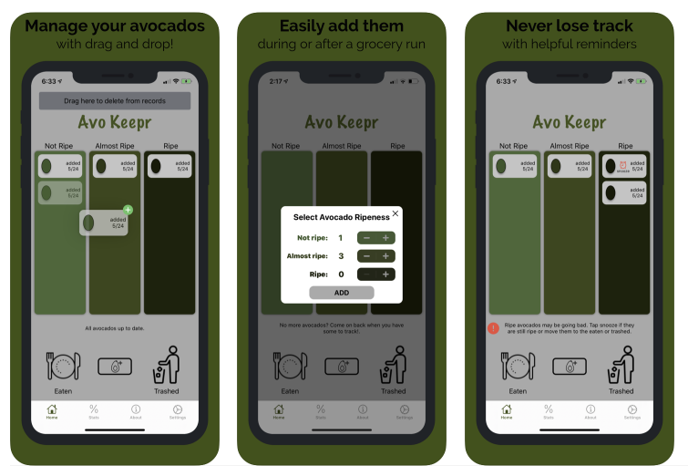
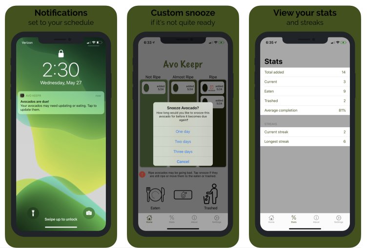

# Avo Keepr

Open source repo for the Avo Keepr app.

[Avo Keepr on the App Store](https://apps.apple.com/us/app/avo-keepr/id1515186481)

**Screenshots:**

**App Store Listing:**

Avo Keepr enables you to track your avocados so they don't end up uneaten in the garbage. Avocados are one of the most delicious and versatile foods but they are often wasted because of their short window of ripeness. This app helps you avoid those moments of disappointment when you cut into an avocado to find it has spoiled.
 
Features:
- Easily add avocados and modify ripeness with a drag and drop interface
- Smart reminders will notify you when an avocado's ripeness may have changed or may be ready to eat
- Choose your preferred reminder time
- Snooze an avocado if it needs more time in its section
- Stats and streaks help you stay on track
 
Additional details:
Simply select the initial ripeness of the avocado when you first buy it at the store or bring it home and the app will remind you if an avocado has been in it's section for 2 days and may need to be moved or eaten.
 
Reminders can be set to any time of day you prefer. We recommend you choose a time that you are typically at home and can easily check on them. View your stats and streaks to keep track of how many you have eaten and thrown away.
 
Enjoy using the app and go out and get some avocados!
 
Questions or feedback? Contact us at avokeepr@gmail.com
No ads, no account needed, no personal information collected. Ever.

**Feel free to contribute!**
